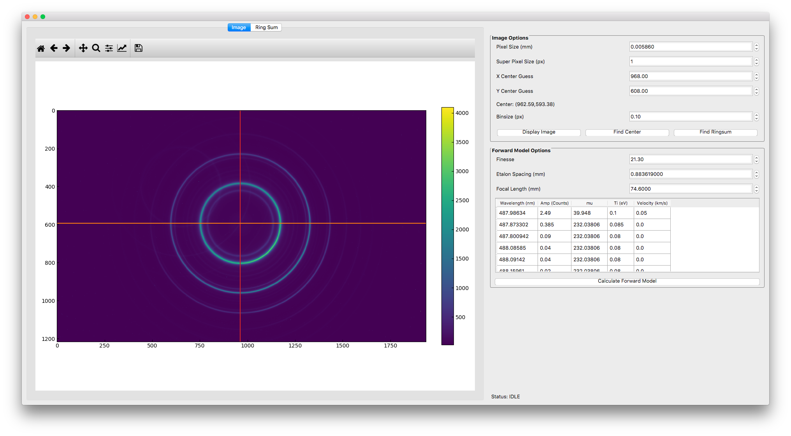
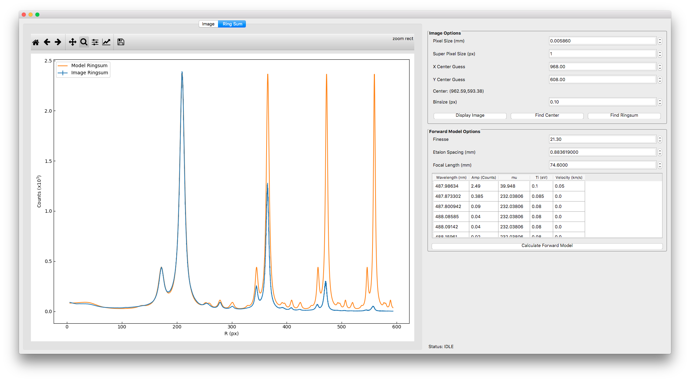

# Welcome to the Fabry Perot Gui

The goal of this project is to have a useful GUI for analyzing images from the Fabry Perot spectrometer at WiPPL. This
is a side project of mine that still has a few kinks to work out.

## Screenshots

*The GUI showing a loaded image.

*The GUI showing an annular sum from a loaded image.

## Dependencies

* [fabry_perot](https://github.com/jmilhone/fabry_perot)
* numpy
* h5py
* rawpy
* matplotlib
* PyQT
* scipy
* numba